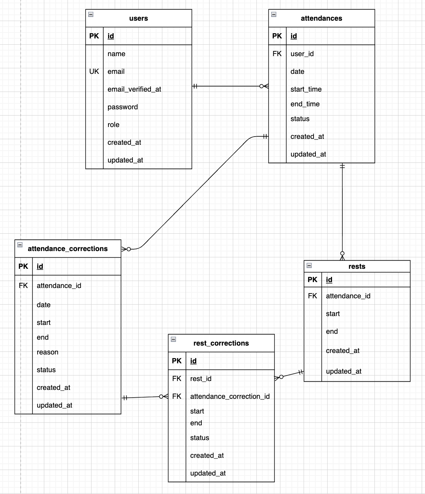

# 勤怠管理アプリ（Time-Keeper）

従業員の毎日の打刻（出勤・退勤・休憩）から、管理者による勤怠データの確認・修正承認、そして労働時間の月次レポート出力までを一元管理できるシステムです。

## 環境構築

Docker（Laravel Sail）を使った環境構築手順です。

### 1. リポジトリのクローンとディレクトリへの移動
```bash
git clone https://github.com/hana20210115/time-keeper.git
cd time-keeper
```

### 2. Composerパッケージのインストール
```bash
docker run --rm \
    -u "$(id -u):$(id -g)" \
    -v "$(pwd):/var/www/html" \
    -w /var/www/html \
    laravelsail/php82-composer:latest \
    composer install --ignore-platform-reqs
```

### 3. 環境変数の設定
```bash
cp .env.example .env
```
※コピーして作成された `.env` ファイルをエディタで開き、以下のデータベース接続情報をSail（Docker）の初期設定に合わせて修正してください。

```env
DB_CONNECTION=mysql
DB_HOST=mysql
DB_PORT=3306
DB_DATABASE=time_keeper
DB_USERNAME=sail
DB_PASSWORD=password
```

### 4. Dockerコンテナのビルドと起動
```bash
./vendor/bin/sail up -d --build
```

### 5. アプリケーションキーの生成
```bash
./vendor/bin/sail artisan key:generate
```

### 6. Vite（npmパッケージ）のインストールとビルド
フロントエンドのスタイル（Tailwind CSSなど）を適用するために必須の作業です。
```bash
./vendor/bin/sail npm install
./vendor/bin/sail npm run build
```

### 7. データベースのマイグレーションとシーディング
ダミーデータ（過去の勤怠記録やテストユーザー）を生成します。
```bash
./vendor/bin/sail artisan migrate:fresh --seed
```

---

## トラブル（環境構築でつまずきやすいポイント）

特にWindows（WSL2）環境で構築する際に発生しやすいエラーと、その解決策をまとめています。

**1. Dockerコンテナのビルド途中で `exit code: 100` などのエラーが出て中断してしまう**

* **原因:** Windows (WSL2) 環境に関して、パッケージダウンロード時にセキュリティ通信（TLS）のパケットサイズが大きくて通信が遮断されてしまうネットワークのバグ（MTU問題）が原因の可能性が高いです。
* **解決策:** Ubuntuのターミナルで以下のコマンドを実行し、通信道路サイズ（MTU）を調整してから、再度ビルドを実行してください。

```bash
# 1. 通信サイズを調整する（パスワードを求められたらUbuntuのパスワードを入力）
sudo ip link set dev eth0 mtu 1350

# 2. キャッシュを使わずに再ビルドする
./vendor/bin/sail build --no-cache
./vendor/bin/sail up -d
```

---

## テスト用アカウント（シーディング済み）

動作確認の際は、用途に合わせて以下のテスト用アカウントをご利用ください。

**【一般ユーザー（打刻・修正申請・レポート閲覧）】**
* メールアドレス: `user1@example.com`
* パスワード: `password`

**【一般ユーザー(勤怠データは空・勤怠打刻用)】**
* メールアドレス: `user2@example.com`
* パスワード:`password`

**【管理者ユーザー（全社員の勤怠確認・修正承認）】**
* メールアドレス: `user3@example.com`
* パスワード: `password`

---

## 利用技術(実行環境)

* PHP 8.x
* Laravel 13.x
* MySQL 8.x
* Laravel Sail (Docker)
* PHPUnit (単体・機能テスト)
* Tailwind CSS

---

## ER図



---

## 主なURL

* **ログイン(一般ユーザー) / 新規登録:** `http://localhost/`
* **打刻画面（一般）:** `http://localhost/attendance`
* **ログイン（管理者）:** `http://localhost/admin/login`
* **勤怠一覧画面（管理者）:** `http://localhost/admin/staff/list`
